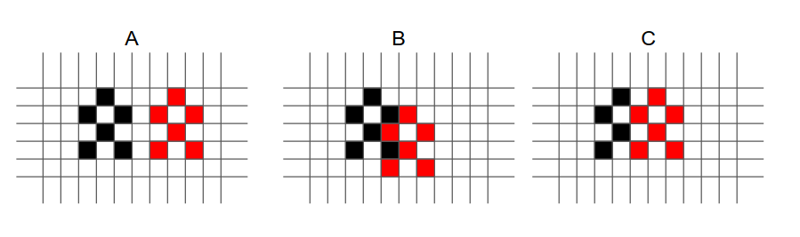
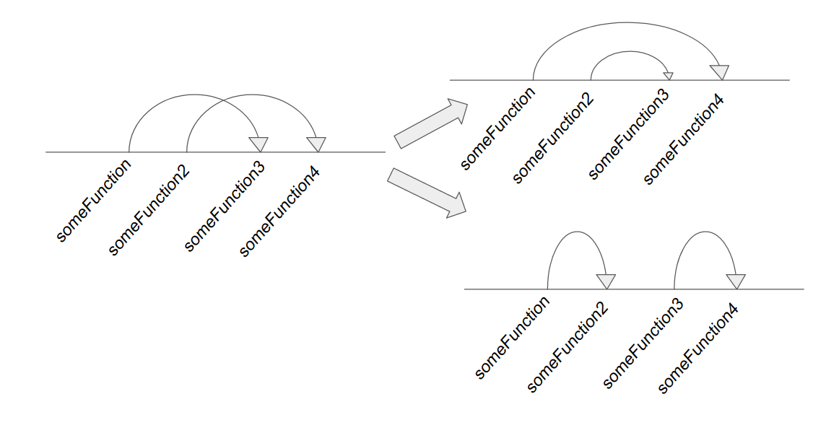

## Tuenti challenge 11

### Intro

These are the solutions to the Tuenti Challenge.
The challenges can be found here https://codechallenge.0x14.net/Challenges, in case it goes down, each folder has a copy of the description in the README.txt.

All solutions accept the input as stdin and output the solution to stdout. stderr is for logging. Something like:

``` cat testInput.txt | go run main.go | tee testOutput.txt```

All of them are written in node or go, when in go the parsing is done with this [library](https://github.com/furstenheim/challenge_encoding).

#### Problem 1

Pretty straightforward. Two dice can sum up to 12. You need at least one more to win

#### Problem 2

We needed to remove some substrings (the pokemon names) from the string. The implementation was pretty straightforward, walk the string and every time you find a pokemon, remove it and start over.

To avoid allocating too many strings I used an array to do everything, but given the size of the problem it was probably not necessary.

It could have been tricky by making you try all combinations, say that removing one pokemon in one place made the other impossible to find, but that was not the case.

#### Problem 3
In this problem we receive words and values for the letters. We need to compute the total value of the words and decide which one was bigger.

The parsing was a bit annoying because there were  different cases. Also, important to use rational instead of floats, just in case there was some rounding error. For example, `1/7 + 1/7 + 1/7 + 1/7 + 1/7 + 1/7 + 1/7 != 1` 

#### Problem 4
We need to build a scale of notes, starting at any given note. Easiest way was to lay down all possible notes in order and just start walking the array from the requested value.

```
var allNotes = []Note{
	{rootValue: "F", faceValue: "F#", intValue: 0},
	{rootValue: "G", faceValue: "Gb", intValue: 0},
	{rootValue: "G", faceValue: "G", intValue: 1},
	{rootValue: "G", faceValue: "G#", intValue: 2},
	{rootValue: "A", faceValue: "Ab", intValue: 2},
	{rootValue: "A", faceValue: "A", intValue: 3},
	{rootValue: "A", faceValue: "A#", intValue: 4},
	{rootValue: "B", faceValue: "Bb", intValue: 4},
	{rootValue: "B", faceValue: "B", intValue: 5},
	{rootValue: "C", faceValue: "Cb", intValue: 5},
	{rootValue: "B", faceValue: "B#", intValue: 6},
	{rootValue: "C", faceValue: "C", intValue: 6},
	{rootValue: "C", faceValue: "C#", intValue: 7},
	{rootValue: "D", faceValue: "Db", intValue: 7},
	{rootValue: "D", faceValue: "D", intValue: 8},
	{rootValue: "D", faceValue: "D#", intValue: 9},
	{rootValue: "E", faceValue: "Eb", intValue: 9},
	{rootValue: "E", faceValue: "E", intValue: 10},
	{rootValue: "F", faceValue: "Fb", intValue: 10},
	{rootValue: "E", faceValue: "E#", intValue: 11},
	{rootValue: "F", faceValue: "F", intValue: 11},
}

```
#### Problem 5

We start with a famous poem and we need to find the clue. We know part of the clue is Mandela.

If we open the file with less, we see some suspicious hidden characters


So first thing is to only keep values that are in the U+E00AA - UE+00FF range. Once they are filtered, again with less, it seems that they are words. And one of them could be Mandela `<U+E007B><U+E006F><U+E007C><U+E0072><U+E0073><U+E007A><U+E006F>`. The U+E006F seems to be the a from mandela, so we need to substract some value to U+E006F so that it returns 65, which is A. after a bit of fiddling we find it and read the clue


#### Problem 6

We need to parse some dates and say the day of the week in some given language. Easiest way is to use a library, in my case moment for node.

#### Problem 7

We connect to a server, and we are inside a labyrinth. We need to navigate it and find the shortest path.

If we only had to reach to the end, we could use some heuristic method, but we need to find the shortest one, and BFS is a good alternative.

It is important to solve the puzzle that we can always jump to a previously discovered position. We can use that to implement a normal BFS. Initially I didn't realize this and I was walking from one position to another and the algorithm was pretty much not going finishing

#### Problem 8

The description of the project is a bit long, but in the end what they ask is to find all the points that when remove make a graph disconnected.

There might be better ways to do it, but just trying city per city works. We remove a city from the graph, choose a second city to start with and do a breadth first search to try to reach every possible city. If we do not manage, then the city disconnects.

#### Problem 9

We have a small (10) list of medium (500) sprites and they are placed in a lot (50000) of different positions. We need to find each pair that intersects.

We need to check intersection for every possible pair, which is basically O(P^2) where P is the number of positions. So we need to make that super fast.

One way to do so is to precompute all possible collisions. We pick every pair of sprites S1, S2, and then check the relative difference at which they intersect. For example, we can say, if S1 is 2 pixels above and 3 to the left of S2, then they intersect. We build a map of all possible intersections. Then we just run over all positions and check real fast if they intersect.



As an example, in the images, in A the sprites are too far away, so we do not even precompute. In B they are close but not intersect. In C they intersect, so we register that if the sprite is two positions to the right then they intersect, it doesn't really matter where they are anchored.


#### Problem 10

This was random googling for me, I found an example on how to extract the content from the tcp packages. A bit of trial and error I found an order that made the file content have 'PNG' in it. Opening it showed a qr code

#### Problem 11
We need to group the given strings into categories of the same size, in such a way that we maximize the sum of common components.

We cannot just try all possible sets, because that would be too long, so we have to be a bit smarter.

First thing that we do is to sort the strings. It makes sense, since they will have more in common if they are closer together. Once we have them together, we realize that we cannot assign them out of order. That is if A < B < C < D. Having A and C in one group and B and D in another, is worse than having A and B, and C and D; or to have A and D and B and C. The proof is simple, root(A, C) <= root(A, B), and root(B, D) <= root(C, D). So root(A, C) + root(B, D) <= root(A, B) + root(C, D).

Thinking of it visually, that means that if we match functions with lines, the lines will not cross:



But that basically means that one of the groups consists of all consecutive functions. So we go over all the array, take n functions and remove them. And then compute over the remaining ones.

In fact, we can just keep the n consecutive ones that give the highest root in a greedy approach. I don't remember why, but I got convinced that was a good idea.


#### Problem 12
We start with bitcoins and start exchanging. We should end up with more than one bitcoin. Important part is that we should do this in the least amount of movements possible.

If every coin is a node, then we have a graph that we navigate through the exchanges. We need to find the shortest path (if possible) to the origin with at least 2 coins.

All exchanges have an exchange rate of >= 1, so we only need to consider two states for each vertex. Either we reach it with one coin or with more than coin, in both cases we want to hold the shortest path to that node, and in case of a tie the one with the most coins.

We do a BFS, which is good to find all shortests paths. Once we get to bitcoin back we keep the one with the biggest amount


#### Problem 13

I skipped this one

#### Problem 14

We want to solve equations like `SEND + MORE = MONEY`. The algorithm is pretty straightforward, pure brute force. But the implementation in JS is really elegant, I got the idea from https://www.dcode.fr/cryptarithm-solver.

Basically, for each equation we build dynamically a solver. And then to check the equality we do it also dynamically. For example, if we want to solve the equation `AB + BC = AC`, then we would build the following function:

```
function findSolutions () {
  const solutions = []
  const exp = ["A","B"," ","+"," ","B","C"," ","=","="," ","A","C"]

  for (let e0 = 1; e0 < 10; e0++) {
    exp[0] = e0
    exp[11] = e0
    for (let e1 = 1; e1 < 10; e1++) {
      if (e1 === e0) continue
      exp[1] = e1
      exp[5] = e1
      for (let e2 = 0; e2 < 10; e2++) {
        if (e2 === e0) continue
        if (e2 === e1) continue
        exp[6] = e2
        exp[12] = e2

        if (eval(exp.join(''))) solutions.push(exp.join('').replace('==', '='))
      }
    }
  }
  return solutions
}

```

That way we don't need to actually parse the expression, we just rely on the JS  engine.

#### Problem 15

More or less we need to compute the factorial modulo some large prime. We need to ignore all those numbers that are pronounced like 20 something, so basically 2x, 2x_xxx and 2x_xxx_xxx... Additionally, since the given prime is not tuentistic, any factorial beyond the prime will be zero. Since it is not such a big number we just brute force it. We compute the factorial up to that number and then solve all tests one after the other.

#### Problem 16
I found this problem quite neat (the mathematician in me). There is a hidden array of length 1000, and we can ask for the GCD of each pair. We need to find all the numbers that are prime or 1.

Let's think first of what happens to a prime. If we do the GCD with all the rest of the numbers we would get either 1 or that prime. And that "only" (more on this later) happens with that number. So we can start with the first number and comb over the whole array. If at some point we've found two different divisors for this number, then we jump to the next position and so on.

The tricky part here is the square numbers. If we had all numbers from 1 to 25, we wouldn't be able to distinguish between 5 and 25. However, it's ok, we try a couple times until we are lucky and we get the right one.


#### Problem 17

This is some sort of gigantic Nim. There are many piles, and we can remove from those piles, but only a power of 2.

This is some sort of generic Nim, and supposedly [this theorem](https://en.wikipedia.org/wiki/Sprague%E2%80%93Grundy_theorem) could be applied. But we can do it a bit more manually.

Ok, let's start with the easy case, only one pile. In the case there is 1 or 2 m3 left, we can remove them so that's a winning position. Now, if there are 3 left, we can remove 1 or two, in both our opponent wins. That means that 3 is a losing position.

If we start in any position, which we can convert to a losing position, that means that we are in a winning position. That is the case with 4 and 5, we can remove 1 and 2 respectively and end up in 3, which is losing. We go next to 6 and we can remove either 1, 2 or 4. All of options lead to winning positions, so we are in a losing position.

At this point it becomes obvious that the losing positions are 0 mod 3. The reason behind that is that (2)^n ≡ (-1)^n mod 3. So if we are 0 mod 3 we can either go to -1 or 1, we do some induction and get to the conclusion.

Let's see then, what happens with several piles, but only amount 1 or 2 in each. We have three options, we remove a pile of 1, a pile of 2, or convert a 2 into a 1. If we code this into two coordinates (a, b), a is the number of piles with 1 and b is the number of piles with 2. Then we can do (a - 1, b), (a, b - 1) or (a + 1, b -1).


Now we start with the easy cases, (0,0) is losing, (1, 0) and (0, 1) is winning. From (2, 0) we can only move to (1, 0), which is winning, so (2, 0) is losing. From (1, 1) we can move to (2, 0) which is losing, so (1, 1) is winning. And so on. If we fill out the grid we notice a pattern.


That is, if #1 ≡ 0 mod 2 and #2 ≡ 0 mod 2 then it is a losing position.

Going back to the generic case, we compute # (things ≡ 1 mod 3) mod 2 and # (things ≡ 2 mod 3) mod 2. If those are both 0 then it is a losing position. The initial case with all amounts smaller or equal to 2 we already proved. For bigger ones, we can do induction on the total sum.

 
#### Problem 18

This was asking to build a [Huffman coding](https://en.wikipedia.org/wiki/Huffman_coding) minimizing the difference between lengths of words.

There is a sketchy comment in the wikipedia saying:
> It is generally beneficial to minimize the variance of codeword length. For example, a communication buffer receiving Huffman-encoded data may need to be larger to deal with especially long symbols if the tree is especially unbalanced. To minimize variance, simply break ties between queues by choosing the item in the first queue. This modification will retain the mathematical optimality of the Huffman coding while both minimizing variance and minimizing the length of the longest character code.

However, I got the solution wrong, so I'm not so sure about it, or possibly I didn't implement it right.

#### Problem 19

We want to find some interferences that are not affected by CRC hashing mechanism. This problem becomes quite natural with a bit of theory...

[GF2](https://en.wikipedia.org/wiki/GF(2)) (Galois field of two elements) basically means to take 0 and 1 and have bitwise sum. So 0 + 1 = 1, 1 + 1 = 0. And bitwise product. 1 * 1 = 1, 0 * 1 = 0...

For this GF2 we can consider all polynomials GF2[X]. Fore example x^3 + x^1. And we map them to binary numbers, in the last case it would be 101.

Given a polynomial f like x ^ n..., the CRC check is hash(g) = (g * x ^ n) mod f.

Back to the question, we are given several interferences (polynomials), and we want to find a common polynomial that makes them undetectable. That is:


```
hash(g) = (g * x ^n) mod f ≡ hash(g + p·i) = ((g + p·i) * x ^ n) mod f
```

So we get that `p·i * x ^ n ≡ 0 mod f`. We are asked that f ends in 1, so we can cancel x ^ n. And then if we take i == 1 we have that `p ≡ 0 mod f`. That is, f has to be a divisor of p. Not only that, we want to find the greatest of them all, and that is basically the GCD.

To compute the GCD we use the Euclides algorithm and we are done.

Of course, there is a bit of mathematical trickery here. All this works because GF2 is a field and then GF(2)[X] is a [Unique factorization domain](https://en.wikipedia.org/wiki/Unique_factorization_domain)... 